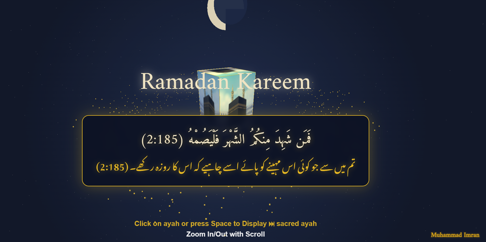

# Ramadan Kareem - A 3D Web Visualization

.

A visually stunning 3D web-based project celebrating Ramadan, featuring the Holy Kaaba, a cosmic sky, and sacred Quranic verses in Arabic with Urdu translations. Built with HTML, CSS, and Three.js, this project aims to inspire and share the beauty of Ramadan with everyone.

## Features
- **3D Kaaba**: A rotating Kaaba with a custom PNG texture, surrounded by a golden aura.
- **Cosmic Sky**: A starry background with a nebula effect for an ethereal atmosphere.
- **Crescent Moon**: A beautifully rendered crescent moon symbolizing Ramadan.
- **Quranic Verses**: Randomly displayed ayahs from the Quran in Arabic with Urdu translations.
- **Interactive Controls**: Click or press Space to cycle through ayahs; use scroll to zoom in/out with OrbitControls.
- **Mobile Optimized**: Lightweight design for smooth performance across devices.
- **Footer Credit**: "Dep.Software Eng" displayed in the bottom-right corner.


## Installation
1. **Clone the Repository**:
   ```bash
   git clone https://github.com/yourusername/ramadan-kareem.git
   cd ramadan-kareem

## Open the Project:
Open index.html in a web browser directly (no server needed for local testing).

Alternatively, use a local server for best results:
bash

npx live-server

## Add Your Kaaba Image:
Replace the kaabaBase64 placeholder in index.html with your own base64-encoded PNG:
javascript

const kaabaBase64 = "data:image/png;base64,YOUR_BASE64_STRING_HERE";

## Usage
Interact: Click anywhere or press the Space key to display a new ayah.

## Zoom: Scroll to zoom in/out of the 3D scene.

## Explore: Drag to rotate the view using OrbitControls.

## Files
index.html: The main file containing HTML, CSS, and JavaScript.

README.md: This documentation file.

## Dependencies
Three.js (v128) - Included via CDN for 3D rendering.

OrbitControls - Included via CDN for camera controls.

Google Fonts:
Amiri for Arabic text.

Noto Nastaliq Urdu for Urdu text.

## Performance Notes
Optimized for mobile by reducing particle counts, disabling antialiasing, and capping pixel ratio.

Tested on modern browsers (Chrome, Firefox, Safari) on both desktop and mobile.

## Contributing
Feel free to fork this repository, submit pull requests, or open issues for suggestions and improvements!
Fork the repo.

Create a new branch (git checkout -b feature-branch).

Commit your changes (git commit -m "Add feature").

Push to the branch (git push origin feature-branch).

Open a pull request.


Inspired by the spirit of Ramadan and Islamic heritage.

Special thanks to xAI’s Grok for coding assistance and optimization ideas.

## License
This project is open-source under the MIT License (LICENSE). Feel free to use, modify, and share!


